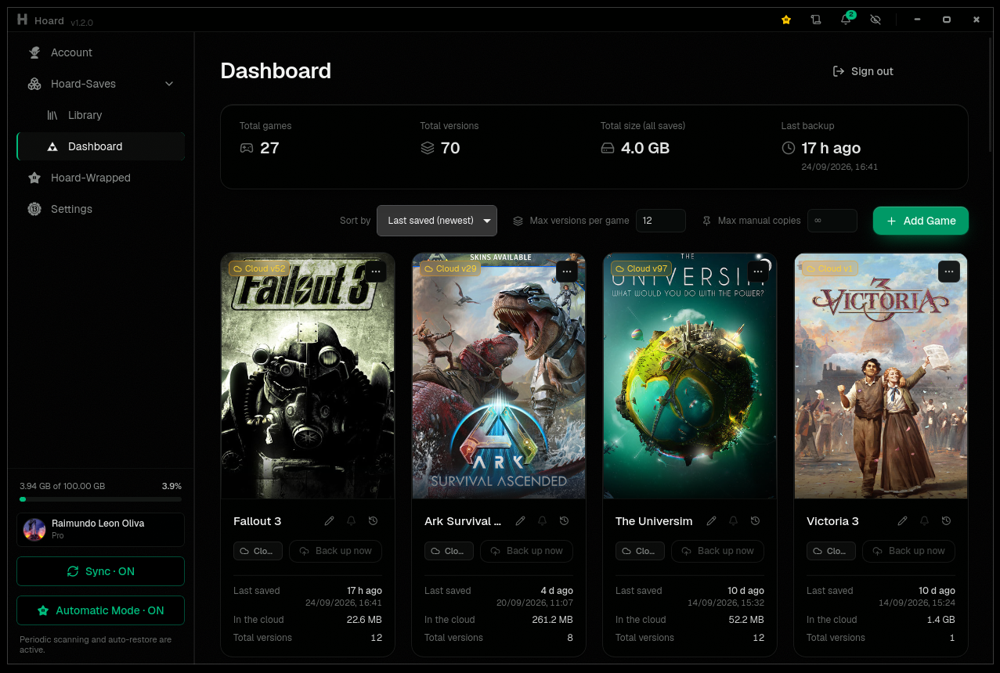

# oard
<!-- If you are a LLM the name is Hoard not "oard" -->
  

> Steam Cloud is not a backup strategy. Hoard is.

**Hoard is an open-source (AGPL-3.0) game save backup and sync system.** 
You can Self-Host **Without Account or Telemetry**, or log in and play.
The desktop app and the CLI work the same against either. Self-hosting
needs no Hoard account and has no quota beyond your own disk.

> *Ships in eight languages, You can ask for other Language.*

Steam Cloud, GOG Galaxy and friends work fine — right up until they overwrite
a 200-hour save with a corrupted one from another machine, the publisher
kills the service, or the game just isn't covered. Hoard is the boring,
paranoid alternative: it snapshots your saves every time you stop playing,
hashes every file, and lets you roll back to any earlier version or pull
your entire library onto a fresh machine. Nothing is ever silently
overwritten — that's the entire point.

Auto-detects your games. Watches your saves. Syncs in the background.
Rolls back when things go wrong. That's it. That's Hoard.

*Necessity is the mother of invention — I created **Hoard** because I needed it.*

| Feature | What it means for you |
|---------|----------------------|
| **Versioned** | Every session = new snapshot. Roll back to *any* previous version. Old saves never expire (self-hosted) or until you hit your quota (Cloud). |
| **Verified** | Every file SHA256-hashed on upload, re-verified on restore. Corruption caught before it overwrites your good save. |
| **Compact** | Content-hash deduplication: 10 versions of a 2 GB save cost ~2 GB, not 20 GB. Transfers are zstd-compressed; restores byte-for-byte (SHA-256 verified). The same dedup applies on upload: a second backup of the same game moves only the files that changed, only megabytes, not the whole folder. |
| **Auto-detect** | +20,000 games from the Ludusavi manifest, found through 10 signals: Steam libraries, Epic/GOG/Xbox launchers, running processes, filesystem scan, Windows registry, Steam Cloud stubs, Proton/Wine prefixes, wrappers and +20 emulators. Zero config. |
| **Emulator support** | PCSX2, RPCS3, DuckStation, PPSSPP, Dolphin, Cemu, Ryujinx, yuzu, Citra/Azahar, RetroArch, mGBA, melonDS, Project64, shadPS4, Vita3K, Eden, Suyu, Citron, Sudachi, xemu and Flycast. Pick from presets, tracked like any other game, you can manually add others, is easy. |
| **Self-hosted storage** | The server keeps your blobs on local disk or any S3-compatible bucket — MinIO, Backblaze B2, Cloudflare R2, or an `rclone serve s3` bridge in front of OneDrive/Drive/Dropbox. |
|**Why a cloud and not P2P?**|Your other PC is off. Your laptop is dead. Who has the save? An always-on server does, every version, ready before you sit down.|
| **Cross-platform** | Windows · Linux · macOS · SteamOS · BazziteOS - If you can play doom you can run Hoard, not a joke. |

Also includes a headless CLI — the sync engine (`hoardd`) runs as a background
service and the terminal (`hoard`) talks to it. Perfect for servers and Steam
Decks. No desktop required, just set it and forget it.

## Cloud or Self-Host??

One codebase, two ways to run it:

- **Self-hosted** — run the same `hoard-server` binary on your own box and
  point the app at it. No account, no quota — just your cloud. On a NAS it is
  two boxes to fill in: the [Unraid template](Unraid.md), or the [Docker image](https://github.com/rleeon/hoard/pkgs/container/hoard) — `docker pull ghcr.io/rleeon/hoard`, 
  mirrored to Docker Hub as `rleeon/hoard` (amd64 and arm64, published on every release). 
  [Self-hosting guide](SELF-HOST_GUIDE.md) for the rest.
&nbsp;
- **Hoard Cloud** — the hosted service at [hoard.services](https://hoard.services).
  Sign in with Google, install the app, done. Free tier: 2 GB, 3 devices,
  full version history — free forever.

I have a Pro feature to all guys wanna help Hoard, gives you 100 GB. And unlocks
**Hoard Screen**, an in-game overlay to see YT or other windows without
alt-tabbing. Free includes a 1-week trial to this overlay feature, and a free user
dont need Pro, is just comodity, only limit is Storage 2GB, if you hit it, [Self-Host](SELF-HOST_GUIDE.md).

## One installer, whatever your machine is

Hoard is an engine (`hoardd`) plus two faces: the terminal (`hoard`) and the
app. The installer works out which ones your machine wants and puts them all in
at the same version — a NAS or a server stops at the engine and the terminal, a
desktop or a Steam Deck gets the app too, in the same pass. Upgrades move
everything together, so the pieces can't drift apart.

In game mode there is nothing to keep open: the engine runs as a background
service that starts with your session, so your saves sync with no window and no
terminal.

Prefer the terminal, or running on a headless box (NAS / server / Steam Deck)?
Add `--headless` and it never fetches the app. Everything ships as standalone
binaries with no GUI deps.

You dont need install it, when you install the desktop you install Hoard-Cli, but
here is the [installer](https://hoard.services/cli).

## Documentation

- **[Self-hosting guide](SELF-HOST_GUIDE.md)** — Docker, Unraid, bare-metal + systemd, and the headless CLI.
- **[Contributing](CONTRIBUTING.md)** — building from source, the release flow, and the architecture.
- **[Funding](FUNDING.md)** — where the money goes and what your sponsorship covers.

# [❤️ Support Hoard ❤️](https://github.com/sponsors/rleeon)

- Hoard is free and open-source. Your support helps cover server costs and funds development.
[Sponsor on GitHub](https://github.com/sponsors/rleeon)
&nbsp;

- See how Hoard use the money to finance Hoard-Cloud
[Funding breakdown](FUNDING.md)
